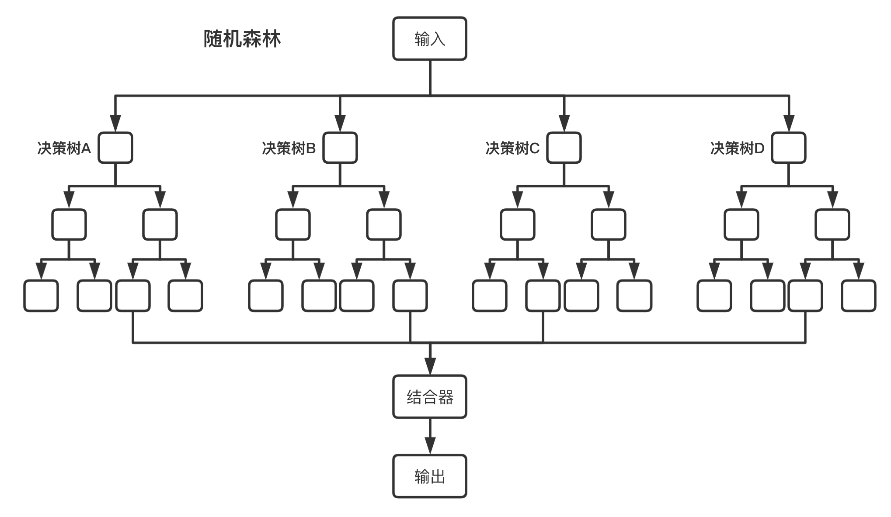

## 扩散模型

扩散模型：和其他生成模型一样，实现从噪声（采样自简单的分布）生成目标数据样本。

扩散模型包括两个过程：前向过程（forward process）和反向过程（reverse process），其中前向过程又称为扩散过程（diffusion process）。无论是前向过程还是反向过程都是一个参数化的马尔可夫链（Markov chain），其中反向过程可用于生成数据样本（它的作用类似GAN中的生成器，只不过GAN生成器会有维度变化，而DDPM的反向过程没有维度变化）。

### 1. 正向扩散过程（Forward Process）
将原始数据 $x_0$ 逐步添加高斯噪声，经过 $T$ 步后转化为纯噪声 $x_T$。  
**数学描述**（离散形式）：
$$
x_t = \sqrt{\alpha_t} x_{t-1} + \sqrt{1-\alpha_t} \epsilon_t, \quad \epsilon_t \sim \mathcal{N}(0, \mathbf{I})
$$
其中：
- $\alpha_t$ 是噪声调度系数（$\alpha_t \in (0,1)$）
- $t \in \{1,2,...,T\}$ 为时间步

**连续形式**（随机微分方程）：
$$
dx = f(x,t)dt + g(t)dw
$$
$w$ 为维纳过程，$f(\cdot)$ 和 $g(\cdot)$ 是预定义函数。

---

### 2. 逆向生成过程（Reverse Process）
通过神经网络学习去噪步骤，从 $x_T$ 逐步恢复数据 $x_0$。

**目标函数**（噪声预测）：
$$
\mathcal{L} = \mathbb{E}_{t,x_0,\epsilon}\left[ \|\epsilon - \epsilon_\theta(x_t,t)\|^2 \right]
$$
其中 $\epsilon_\theta$ 是神经网络（如U-Net）预测的噪声。

**采样步骤**：
$$
x_{t-1} = \frac{1}{\sqrt{\alpha_t}}\left( x_t - \frac{1-\alpha_t}{\sqrt{1-\bar{\alpha}_t}} \epsilon_\theta(x_t,t) \right) + \sigma_t z
$$
其中：
- $\bar{\alpha}_t = \prod_{s=1}^t \alpha_s$
- $z \sim \mathcal{N}(0,\mathbf{I})$
- $\sigma_t$ 为噪声系数

---

变分下界（ELBO）
$$
\log p(x) \geq \mathbb{E}_q \left[ \log \frac{p(x_{0:T})}{q(x_{1:T}|x_0)} \right]
$$

扩散核（Diffusion Kernel）
$$
q(x_t|x_0) = \mathcal{N}(x_t; \sqrt{\bar{\alpha}_t}x_0, (1-\bar{\alpha}_t)\mathbf{I})
$$

---

## 随机森林

将多个决策树结合在一起，每次数据集是随机有放回的选出，同时随机选出部分特征作为输入，所以该算法被称为随机森林算法。可以看到随机森林算法是以决策树为估计器的Bagging算法。

随机森林算法的优点：

    1 对于很多种资料，可以产生高准确度的分类器
    2 可以处理大量的输入变量
    3 可以在决定类别时，评估变量的重要性
    4 在建造森林时，可以在内部对于一般化后的误差产生不偏差的估计
    5 包含一个好方法可以估计丢失的资料，并且如果有很大一部分的资料丢失，仍可以维持准确度
    6 对于不平衡的分类资料集来说，可以平衡误差
    7 可被延伸应用在未标记的资料上，这类资料通常是使用非监督式聚类，也可侦测偏离者和观看资料
    8 学习过程很快速
    
随机森林算法的缺点：

    1 牺牲了决策树的可解释性
    2 在某些噪音较大的分类或回归问题上会过拟合
    3 在多个分类变量的问题中，随机森林可能无法提高基学习器的准确性

## 模仿学习

模仿学习是一种在没有显式奖励信号的情况下，让智能体学习专家策略的方法。其核心思想是：通过观察专家的行为，学习一个策略，使其能够像专家一样完成任务。

模仿学习与强化学习有着密切的联系，但也有着本质的区别。强化学习的目标是优化一个由奖励函数定义的策略，而模仿学习的目标是复制一个由专家演示定义的策略。换句话说，强化学习是「创造」策略，而模仿学习是「模仿」策略。

### 行为克隆
行为克隆（Behavioral Cloning, BC） 是最简单、最直接的模仿学习方法。它的核心思想是将模仿学习视为一个监督学习问题，即：给定一系列专家演示数据，学习一个从状态到动作的映射。

假设我们有一组专家演示数据 \( D = \{ (s_i, a_i) \}_{i=1}^N \)，其中 \( s_i \) 表示状态，\( a_i \) 表示专家在状态 \( s_i \) 下采取的动作。行为克隆的目标是学习一个策略 \( \pi(a|s) \)，使得在给定状态 \( s \) 的情况下，策略 \( \pi(a|s) \) 能够预测出与专家动作 \( a \) 相似的动作。

形式化地说，行为克隆的目标是最小化以下损失函数：

$$
\mathcal{L}(\pi) = \mathbb{E}_{(s,a) \sim D} \left[ l(\pi(a|s), a) \right]
$$

其中，\( l(\cdot, \cdot) \) 表示一个合适的损失函数，例如交叉熵损失（Cross-Entropy Loss）或均方误差损失（Mean Squared Error Loss）。

### 逆强化学习
逆强化学习（Inverse Reinforcement Learning, IRL）是另一种重要的模仿学习方法。与行为克隆不同，逆强化学习不是直接学习策略，而是从专家演示中推断奖励函数，然后使用强化学习方法优化策略。

逆强化学习的思想是：假设专家之所以能够做出好的行为，是因为他们优化了一个未知的奖励函数。因此，我们可以从专家演示中学习这个未知的奖励函数，然后使用强化学习方法优化策略。

形式化地说，逆强化学习的目标是找到一个奖励函数 $R(s, a)$，使得专家策略 $\pi_E$ 在该奖励函数下的期望累积回报最大：

$$
R^* = \arg\max_R \mathbb{E}_{\pi_E} \left[ \sum_{t=0}^{\infty} \gamma^t R(s_t, a_t) \right]
$$

其中，$\gamma$ 是折扣因子，$\pi_E$ 表示专家策略。

### 生成对抗模仿学习
生成对抗模仿学习（Generative Adversarial Imitation Learning, GAIL）是一种基于生成对抗网络（GAN）的模仿学习方法。它通过对抗训练，学习一个能够模仿专家行为的智能体。

对抗模仿学习的核心思想是：将模仿学习问题转化为一个生成对抗问题。具体来说，我们训练一个智能体（生成器）和一个判别器，智能体试图模仿专家行为，判别器试图区分智能体和专家的轨迹。通过对抗训练，智能体逐渐学习到接近专家策略的行为。

形式化地说，对抗模仿学习的目标是找到一个策略 \(\pi\) 和一个判别器 \(D\)，使得：

$$
\min_{\pi} \max_{D} \mathbb{E}_{(s, a) \sim \pi_E} [\log D(s, a)] + \mathbb{E}_{(s, a) \sim \pi} [\log(1 - D(s, a))]
$$

其中，\(\pi_E\) 表示专家策略，\(\pi\) 表示智能体策略，\(D(s, a)\) 表示判别器对状态-动作对 \((s, a)\) 的判别结果，取值范围为 \([0, 1]\)。

GAIL 除了可以克服奖励函数多义性问题外，还可以学习专家策略中的复杂行为模式，例如多模态行为（Multi-modal Behavior）。但 GAN 也是出了名的难以训练，容易出现梯度消失、模式崩塌等问题。

## 对抗学习
GAN的全称是Generative adversarial network：
生成网络(Generator)负责生成模拟数据；判别网络(Discriminator)负责判断输入的数据是真实的还是生成的。生成网络要不断优化自己生成的数据让判别网络判断不出来，判别网络也要优化自己让自己判断得更准确。二者关系形成对抗，因此叫对抗网络。

## Planning with Diffusion for Flexible Behavior Synthesis

基于模型的强化学习算法通常仅利用学习来估计近似的动态模型，将其余的决策工作交给经典的轨迹优化器。尽管这种组合在概念上很简单，但经验上存在一些缺陷，表明学习到的模型可能不太适合标准的轨迹优化。在本文中，我们考虑将轨迹优化步骤融入到建模过程中，这样从模型中采样与从模型中规划轨迹几乎是相同的任务。我们的技术方法的核心是一种扩散概率模型，它通过迭代去噪轨迹来进行规划。我们将分类器引导采样和图像修补重新解释为连贯的规划策略，探索了基于扩散的规划算法独特且有用的性质，并展示了我们的框架在强调长期决策和测试目标适应性的控制环境中的有效性。

传统的基于模型的规划算法都是自回归地向前预测，而 Diffuser 能够同时预测路径规划中所有的时间步。扩散模型的迭代采样过程具有灵活的添加条件的能力，允许辅助引导信息修改采样的过程，以还原出高收益或满足一系列约束条件的轨迹。这种基于数据驱动的轨迹优化算法具有几种迷人的特点：

* 长程可扩展性 Diffuser 是以生成轨迹的准确性——而非单步转移的准确性——为目标进行训练的，因此它不会受到单步动力学模型在长时间的序列上，推演误差会逐步累积放大的影响，能够更好地应对长时间的规划需求。
* 任务可组合性 奖励函数提供了采样规划时可用的辅助梯度。通过将多个奖励梯度相加，我们可以简单地将它们组合起来以进行规划。
* 时序可组合性 Diffuser 通过迭代地提高局部一致性来生成全局一致的轨迹，这也就意味着它可以通过将训练轨迹分布中的转移子序列拼接在一起来推广得到分布以外的新的轨迹。
* 高效的非贪心规划 通过模糊模型和规划器之间的边界，用于改进模型预测能力的训练过程也会提高其规划能力。这种设计产生了一个经过学习得来的规划器，可以解决许多传统规划算法难以解决的长时程、稀疏奖励的问题。

本工作的核心贡献是为轨迹数据设计了一种去噪扩散模型，并提供了一个行为合成的概率框架。

diffusion model 具有更强的建模复杂分布的能力，能够更好地建模表征数据的各种特性，但是决策类问题除了需要处理表征建模的挑战，更注重于学习智能体策略的有效性和多样性。一种可行的思路是选择模仿学习方法，使用扩散模型来更好地“模仿”，“拟合”专家策略的数据分布

## Motion Planning Diffusion:  Learning and Planning of Robot Motions with Diffusion Models

Learning priors on trajectory distributions can help accelerate robot motion planning optimization. Given previously successful plans, learning trajectory generative models as priors for a new planning problem is highly desirable. Prior works propose several ways on utilizing this prior to bootstrapping the motion planning problem. Either sampling the prior for initializations or using the prior distribution in a maximum-a-posterior formulation for trajectory optimization. In this work, we propose learning diffusion models as priors. We then can sample directly from the posterior trajectory distribution conditioned on task goals, by leveraging the inverse denoising process of diffusion models. Furthermore, diffusion has been recently shown to effectively encode data multimodality in high-dimensional settings, which is particularly well-suited for large trajectory dataset. To demonstrate our method efficacy, we compare our proposed method - Motion Planning Diffusion - against several baselines in simulated planar robot and 7-dof robot arm manipulator environments. To assess the generalization capabilities of our method, we test it in environments with previously unseen obstacles. Our experiments show that diffusion models are strong priors to encode high-dimensional trajectory distributions of robot motions.

